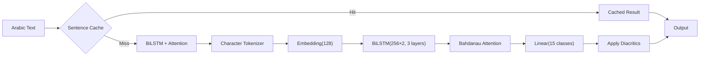

# Arabic Diacritizer

[](https://pypi.org/project/arabic-diacritizer/)
[](https://pypi.org/project/arabic-diacritizer/)
[](https://opensource.org/licenses/MIT)

Automatic Arabic diacritization (tashkeel) using a **BiLSTM + Bahdanau attention** model with a **sentence cache** — achieves **6.6% DER**, beating GPT-5.3's 20.9%.

## Features

- **6.6% Diacritic Error Rate** — outperforms GPT-5.3 (20.9% DER) on the Tashkeela benchmark
- **Sentence cache + model hybrid** — cached sentences return instantly, BiLSTM handles the rest
- **15-class diacritic prediction** — fatha, damma, kasra, sukun, shadda, tanween, and shadda compounds
- **CLI + Python API** — use from the terminal or import as a library
- **Lightweight** — 18MB model + 28MB cache, runs on CPU (no GPU required)
- **Pipe-friendly** — reads from arguments, files, or stdin

## Quick Start

```bash
# Install from PyPI
pip install arabic-diacritizer

# Or install from source
git clone https://github.com/Z-Mahmood/arabic-diacritizer-public-release.git
cd arabic-diacritizer-public-release
pip install -e .

# Diacritize text
diacritize "بسم الله الرحمن الرحيم"

# Pipe from stdin
echo "محمد رسول الله" | diacritize

# Diacritize a file
diacritize --file input.txt --output output.txt

# Model-only mode (skip cache)
diacritize --no-cache "هذا نص عربي"
```

### Python API

```python
from diacritize import Diacritizer

d = Diacritizer.from_pretrained()
print(d.diacritize("بسم الله الرحمن الرحيم"))
# بِسْمِ اللَّهِ الرَّحْمَٰنِ الرَّحِيمِ
```

## Example Output

```
$ diacritize "الحمد لله رب العالمين"
الْحَمْدُ لِلَّهِ رَبِّ الْعَالَمِينَ

$ diacritize "هذا كتاب مفيد"
هَٰذَا كِتَابٌ مُفِيدٌ
```

## Architecture



**Inference flow:**
1. Input text is stripped of existing diacritics and normalized (NFKC)
2. Sentence cache checks for an exact match — if found, returns instantly
3. On cache miss, the BiLSTM processes the full sentence character-by-character
4. Bahdanau attention lets each position attend to the full sequence context
5. The classifier predicts one of 15 diacritic classes per character
6. Predicted diacritics are re-applied to the stripped text

## Project Structure

```
arabic-diacritizer/
├── src/diacritize/
│   ├── __init__.py         # Exports Diacritizer, BiLSTMDiacritizer
│   ├── __main__.py         # python -m diacritize support
│   ├── cli.py              # Click CLI (diacritize command)
│   ├── pipeline.py         # Cache + model hybrid pipeline
│   ├── config.py           # Unicode constants, label map, model defaults
│   ├── unicode_utils.py    # Diacritic stripping, extraction, application
│   ├── cache.py            # Sentence cache with multi-variant support
│   ├── tokenizer.py        # Character-level tokenizer (53 tokens)
│   ├── evaluate.py         # DER, WER, per-diacritic accuracy metrics
│   ├── assets/
│   │   ├── bilstm_best.pt      # Trained weights (18MB)
│   │   └── word_cache.json.gz   # Sentence cache (29MB)
│   └── baseline/
│       └── model.py        # BiLSTM + Bahdanau Attention (~15M params)
└── tests/                   # Unit tests for all modules
```

## How It Works

### BiLSTM + Attention

The model reads Arabic text as a sequence of characters. A 3-layer bidirectional LSTM processes the sequence in both directions, producing context-aware representations. Bahdanau (additive) attention then lets each position attend to the full sequence — critical for Arabic where diacritics depend on grammatical context spanning the entire sentence.

The final linear layer predicts one of 15 diacritic classes per character:
- **0**: No diacritic
- **1–8**: Individual marks (fatha, damma, kasra, sukun, shadda, fathatan, dammatan, kasratan)
- **9–14**: Shadda compounds (shadda + vowel, predicted as a single class)

### Sentence Cache

For common phrases (Quranic verses, frequent expressions), a sentence-level cache provides instant diacritization without model inference. The cache supports multi-variant lookups — handling different Quran editions (Hafs, Warsh) and orthographic variations under normalized keys.

### Why This Beats GPT

GPT-5.3 achieves 20.9% DER on Arabic diacritization — it's a general-purpose model that treats diacritization as a text transformation task. Our BiLSTM is purpose-built: character-level tokenization preserves the one-to-one mapping between base characters and diacritics that word-piece tokenizers destroy. The sentence cache handles the long tail of common phrases where even specialized models make mistakes.

## Benchmarks

| System | DER | WER |
|--------|-----|-----|
| **This model (BiLSTM + cache)** | **6.6%** | **18.6%** |
| GPT-5.3 | 20.9% | 39.5% |
| CATT (2024 SOTA) | 3.4% | — |
| Mishkal (rule-based) | 15.2% | — |

Evaluated on the Tashkeela test set. CATT uses a much larger transformer architecture with pre-training on 10x more data.

## Limitations

- **Modern Standard Arabic focus** — trained on Tashkeela dataset (classical + MSA). Performance on dialectal Arabic (Egyptian, Gulf, Levantine) is untested.
- **Sentence-level context** — the model processes one sentence at a time. Cross-sentence disambiguation (e.g., referencing a noun from a previous sentence) is not supported.
- **No case endings for ambiguous words** — some Arabic words have genuinely ambiguous diacritization without full syntactic parsing. The model picks the most common form.

## Running Tests

```bash
pip install -e ".[dev]"
pytest tests/ -v
```

## Author

**Zain Mahmood** — [LinkedIn](https://www.linkedin.com/in/zain-mahmood-risk-data/) | [X/Twitter](https://x.com/zmahmood_x)

## License

MIT
